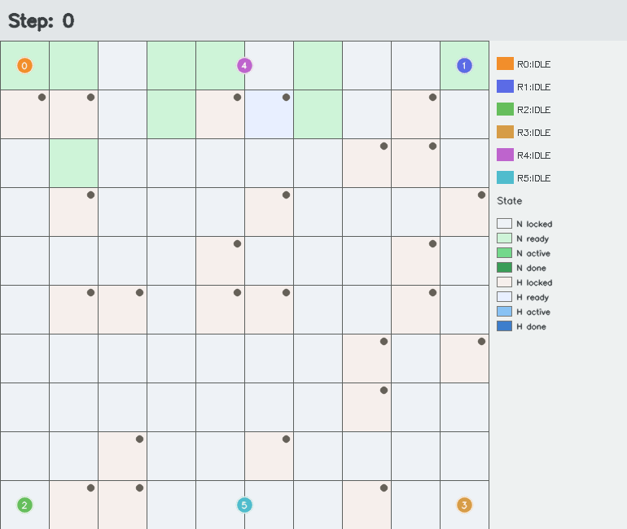
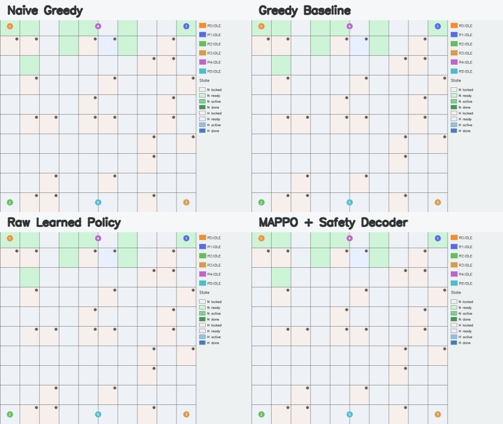
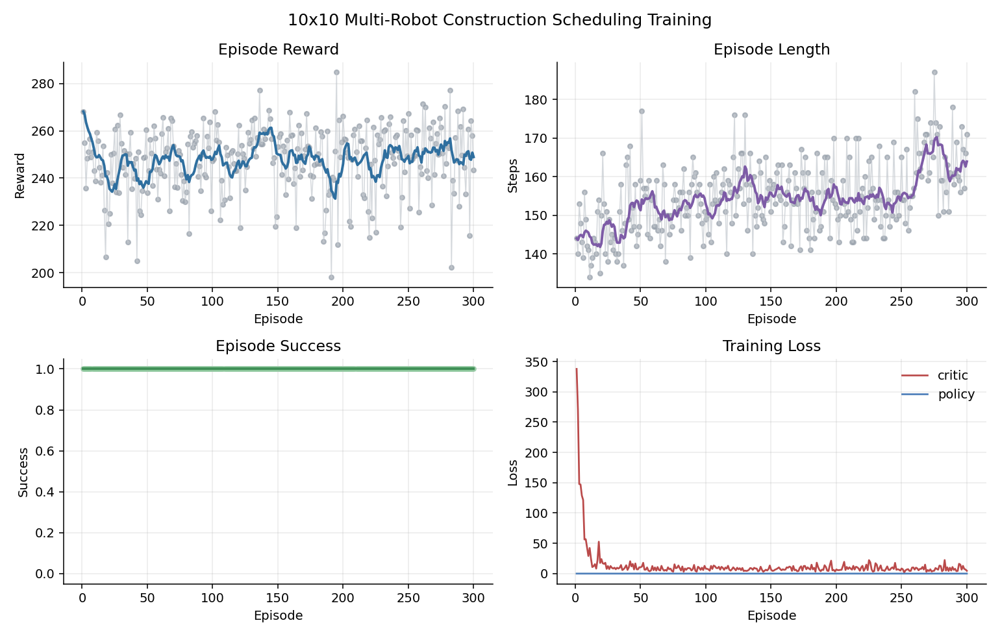

# Multi-Robot Construction Scheduling with MAPPO

This repository contains a PyTorch reinforcement learning project for
high-level multi-robot construction scheduling. A team of heterogeneous robots
must complete a `10 x 10` construction grid with module dependencies, normal
and heavy module types, stochastic task durations, Manhattan travel time, and a
shared crane resource.

The final method is a MAPPO-inspired centralized-training /
decentralized-execution approach. A shared actor network scores module
assignments for each robot, while a centralized critic estimates the value of
the full construction state. A behavior-cloning warm start and a safety decoder
are used to improve feasibility and coordination.

## Main Files

- `construction_scheduling_env.py`
  - Defines the construction scheduling environment.
  - Handles module dependencies, robot states, heavy-module cooperation, crane
    constraints, rewards, action masks, and RGB visualization.

- `train_mappo_construction_pytorch.py`
  - Trains the PyTorch MAPPO-inspired agent.
  - Includes the shared actor, centralized critic, rollout buffer, behavior
    cloning, PPO update, training loop, and training-time policy comparison.

- `validate_construction_policy_pytorch.py`
  - Loads a trained `.pth` model.
  - Evaluates the learned policy against greedy baselines.
  - Saves validation metrics and GIF visualizations.

- `models_pytorch/`
  - Contains the trained PyTorch checkpoints used for validation.

- `results/`
  - Contains training curves, validation metrics, and generated GIF results.

## Environment Setup

The code was developed and tested on Ubuntu/Linux using conda. Ubuntu/Linux is
recommended for reproducing the results.

Create the conda environment:

```bash
conda env create -f environment.yml
conda activate me5406-mappo
```

Alternatively, install the Python dependencies into an existing environment:

```bash
pip install -r requirements.txt
```

The main dependencies are PyTorch, NumPy, OpenCV, Matplotlib, and ImageIO.

## Problem Formulation

The construction site is represented as a grid of modules. In the default
setting, there are 100 modules and 6 robots.

- Each episode samples a new dependency DAG.
- A module can only be assigned after all prerequisites are completed.
- Normal modules require one robot.
- Heavy modules require two robots and use the shared crane resource.
- Robots have heterogeneous capabilities for normal and heavy tasks.
- Robot travel time is computed using Manhattan distance and included in task
  duration.
- The team objective is to complete all modules efficiently while avoiding
  invalid assignments and resource conflicts.

The action space is high-level task selection:

- `0 ... num_modules - 1`: assign the robot to a module.
- `num_modules`: wait.

This abstraction focuses on cooperative task allocation and construction
scheduling rather than low-level motor control.

## Method

The method follows a MAPPO-inspired design:

- **Shared actor:** all robots use the same actor network to score actions from
  robot-specific observations.
- **Centralized critic:** the critic receives the global construction state and
  predicts a team value.
- **Action masking:** illegal actions are masked before sampling or greedy
  selection.
- **Behavior cloning:** the actor is warm-started using demonstrations from a
  greedy construction scheduler.
- **PPO update:** the policy is updated with a clipped PPO objective.
- **Safety decoder:** during evaluation, learned action preferences can be
  decoded into feasible joint actions that respect normal-task uniqueness,
  heavy-task pairing, and crane availability.

The validation script compares four policies:

- `Naive greedy`: simple dependency-aware assignment.
- `Greedy baseline`: distance-, capability-, and crane-aware hand-designed
  scheduler.
- `Raw learned policy`: direct greedy execution of the learned actor.
- `MAPPO + Safety Decoder`: learned actor preferences with feasibility decoding.

## Training

To train the final PyTorch model:

```bash
python train_mappo_construction_pytorch.py \
  --episodes 300 \
  --bc-episodes 300 \
  --bc-epochs 20 \
  --eval-interval 50 \
  --eval-episodes 10 \
  --save-dir models_pytorch \
  --plot-interval 10 \
  --plot-path results/pytorch_training_curves.png
```

Main training outputs:

- `models_pytorch/construction_mappo_best_raw_eval.pth`
- `models_pytorch/construction_mappo_final.pth`
- `models_pytorch/training_log.csv`
- `results/pytorch_training_curves.png`

## Validation

To evaluate the trained model and generate GIF visualizations:

```bash
python validate_construction_policy_pytorch.py \
  --model models_pytorch/construction_mappo_best_raw_eval.pth \
  --episodes 20 \
  --gif-dir results/pytorch_validation_final \
  --gif-duration 0.65 \
  --metrics-json results/pytorch_validation_final_metrics.json
```

Validation outputs:

- `results/pytorch_validation_final/naive_greedy.gif`
- `results/pytorch_validation_final/raw_policy.gif`
- `results/pytorch_validation_final/safe_decoder.gif`
- `results/pytorch_validation_final/greedy_baseline.gif`
- `results/pytorch_validation_final/comparison_2x2.gif`
- `results/pytorch_validation_final/naive_greedy_final.png`
- `results/pytorch_validation_final/raw_policy_final.png`
- `results/pytorch_validation_final/safe_decoder_final.png`
- `results/pytorch_validation_final/greedy_baseline_final.png`
- `results/pytorch_validation_final/comparison_2x2_final.png`
- `results/pytorch_validation_final_metrics.json`

The visualization distinguishes normal and heavy modules, as well as locked,
ready, active, and completed module states. Robot motion is displayed with
Manhattan-style movement.

## Demo

The following GIF shows one successful validation rollout using the final
`MAPPO + Safety Decoder` policy:



The following 2x2 GIF compares all four evaluated policies:



## Training Diagnostics

The training log is saved to `models_pytorch/training_log.csv`. The generated
training diagnostic plot is shown below:



## Example Result

One final evaluation on the `10 x 10` construction task produced:

| Method | Success | Reward | Length | Completed |
| --- | ---: | ---: | ---: | ---: |
| Naive greedy | 0.000 | -1121.54 | 900.0 | 18.4 |
| Greedy baseline | 1.000 | 303.31 | 133.2 | 100.0 |
| Raw learned policy | 1.000 | 250.23 | 146.5 | 100.0 |
| MAPPO + Safety Decoder | 1.000 | 302.35 | 138.8 | 100.0 |

The raw learned policy successfully completes the randomized construction task.
Adding the safety decoder improves efficiency and brings the learned approach
close to the strong hand-designed greedy baseline.
